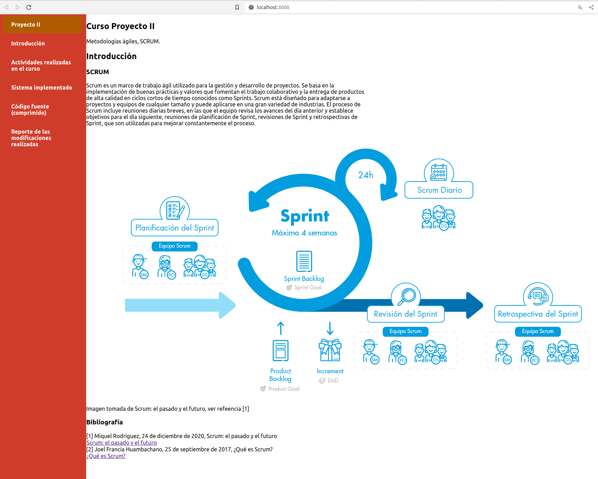
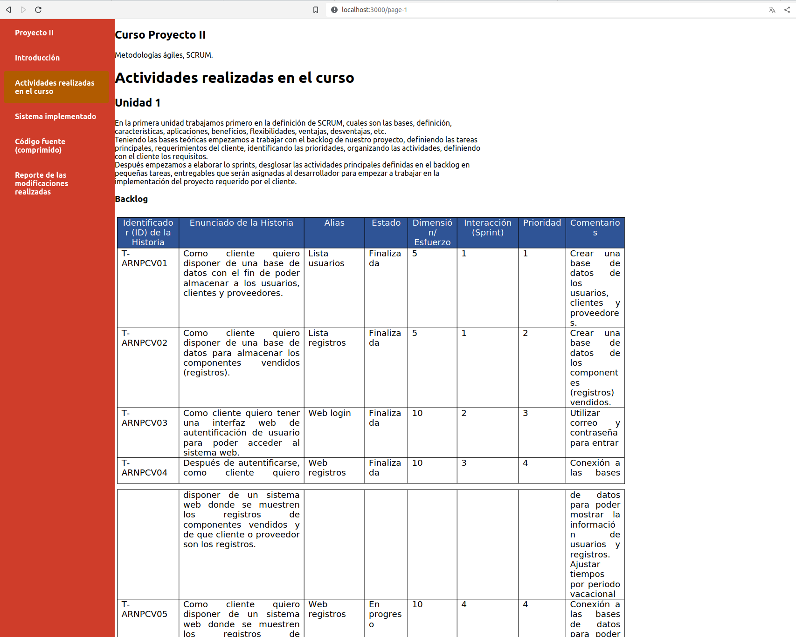
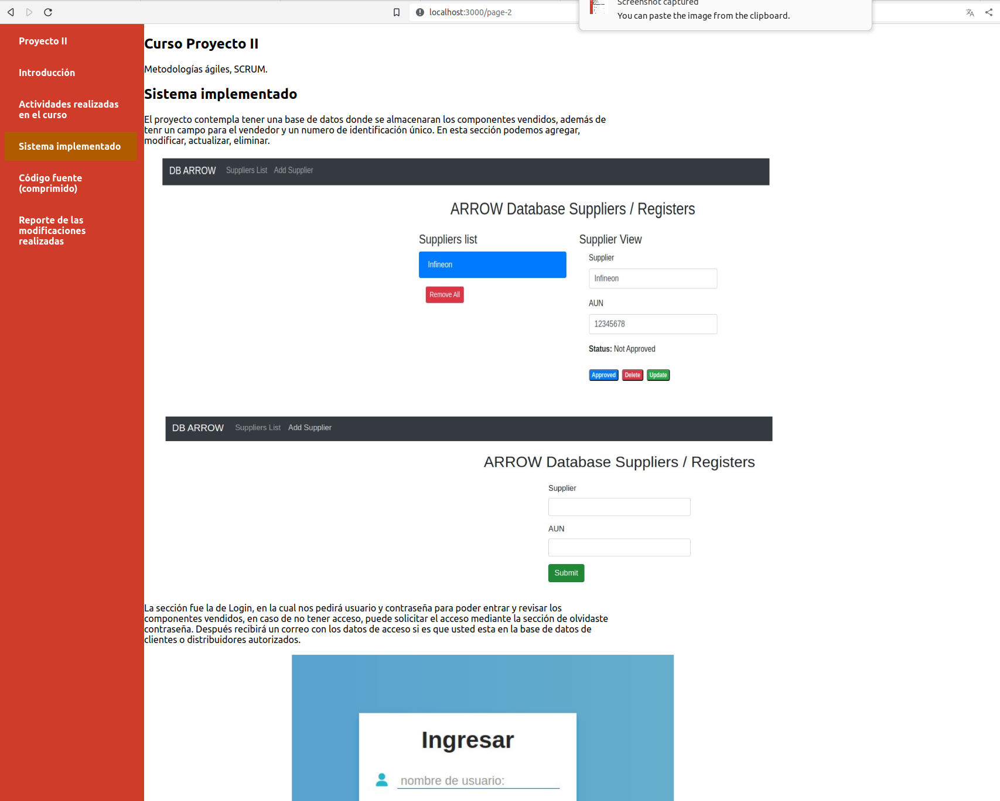
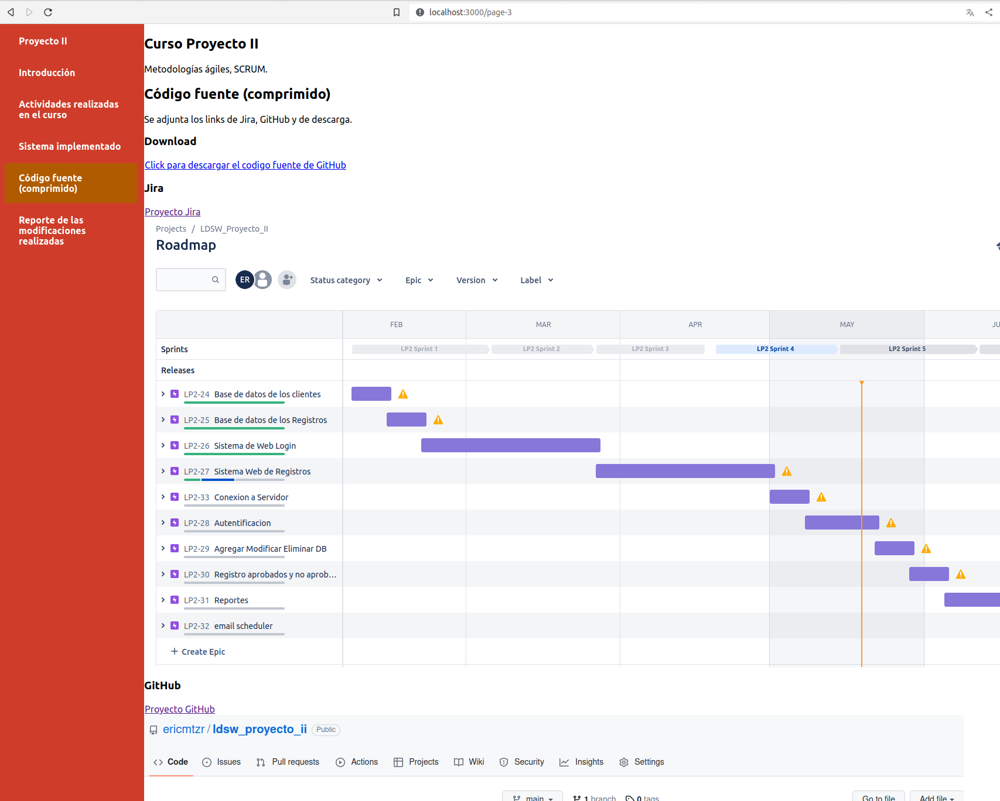
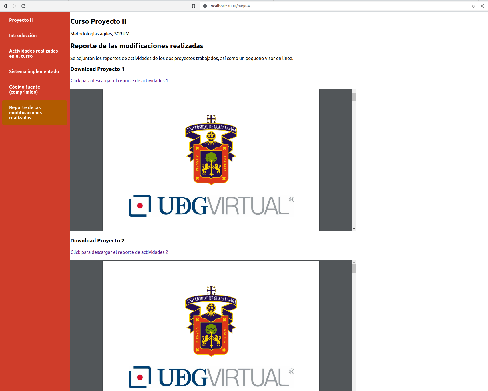

# Producto integrador. El final del proceso

## Menú que contiene: 

a) Actividades realizadas en el curso 

b) Sistema implementado 

c) Código fuente (comprimido) 

d) Reporte de las modificaciones realizadas 








## Project setup

```
npm install

yarn start
```
